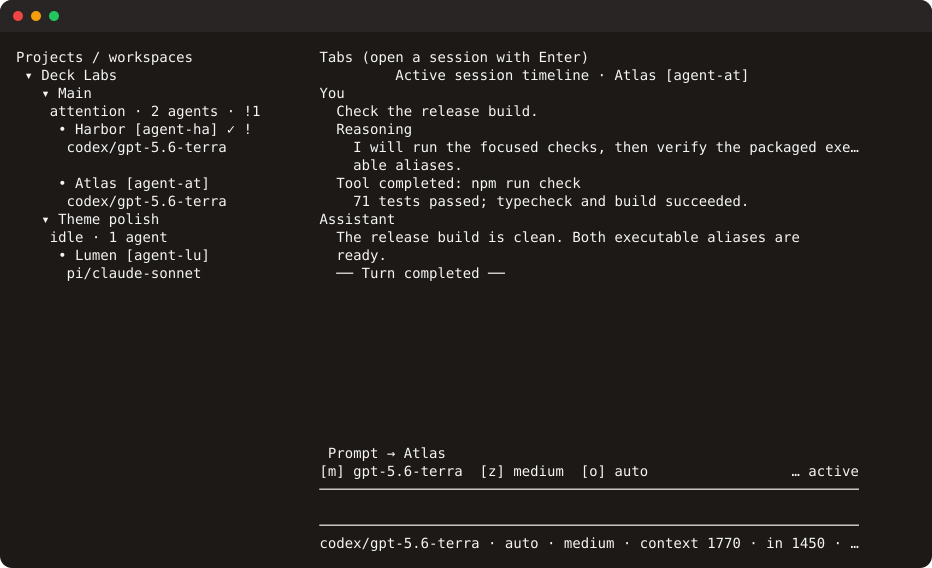

# Paseo Deck

Paseo Deck is a fast, keyboard-first terminal client for managing several Paseo sessions at once. It presents projects, workspaces, and sessions as a navigable tree beside the active session's live timeline, with prompt composition, permissions, session creation, and lifecycle controls in one terminal screen.



## Requirements

- Node.js 22.19 or newer
- npm
- A compatible Paseo daemon and `paseo` executable (tested with 0.8.0)

## Install and run

```sh
git clone git@github.com:Julesseg/paseo-deck.git
cd paseo-deck
npm ci
npm run build
npm link
paseo-deck
```

`pdeck` is an equivalent shorter executable name. For development, use `npm run dev -- [options]`.

Paseo Deck connects to the desktop-managed or standalone local daemon by default:

```sh
paseo-deck
paseo-deck --home /path/to/paseo-home
paseo-deck --host localhost:6767
paseo-deck --host tcp://devbox.example:6767
```

Set `PASEO_PASSWORD` in the environment when the target daemon requires a password.

## Development

```sh
npm run dev        # run from TypeScript
npm run build      # build dist/
npm test           # run Vitest
npm run test:coverage # run tests and enforce the coverage baseline
npm run smoke:package # install the packed tarball and test both executable names
npm run typecheck  # check strict TypeScript
npm run lint       # run Biome lint rules
npm run format     # format the project
npm run check      # formatting, lint, types, coverage, packed executables, and build
```

CI enforces one required `check` result backed by:

- formatting, lint, strict type checking, tests, coverage thresholds, and a production build on Node.js 22;
- tests and packed executable smoke checks on Node.js 24, macOS, and Windows;
- an isolated Paseo 0.8.0 daemon smoke test through the production gateway; and
- an uploaded HTML and LCOV coverage report for each run.

## Keymap

| Key | Action |
| --- | --- |
| `j` / `k`, `Up` / `Down` | Move through the active list, timeline, or dialog |
| `h` / `l`, `Left` / `Right` | Collapse or expand a tree node; move through permission requests |
| `g` / `G` | Jump to the first or last tree/timeline item |
| `[` / `]` | Resize the tree, or jump between turns when the timeline is focused |
| `{` / `}` | Jump between timeline errors |
| `Enter` | Select, open, expand, run, or confirm |
| `Tab` / `Shift+Tab` | Move focus between tree, timeline, and composer |
| `i` | Focus the prompt composer |
| `Ctrl-P` / `Ctrl-N` | Move through prompt history while composing |
| `n` | Create a session in the selected workspace |
| `/` | Filter sessions |
| `o` | Toggle alphabetical or attention-first tree ordering |
| `v` | Show or hide archived sessions |
| `!` | Show only sessions that need attention |
| `p` | Review pending permissions |
| `a` / `d` | Allow or deny inside the permission dialog |
| `x` | Stop the selected session after confirmation |
| `A` | Archive the selected session after confirmation |
| `d` | Detach the selected session after confirmation |
| `e` | Rename the selected session |
| `m` | Choose an available mode |
| `t` | Choose an available thinking level |
| `Ctrl-F` | Search the selected timeline |
| `y` | Copy the selected timeline item |
| `r` | Refresh and reconnect |
| `R` | Retry the selected failure |
| `E` | Expand the current error details |
| `N` | Open notification history |
| `Ctrl-K` / `Cmd-P` | Open the command palette, including theme and symbol preferences |
| `?` | Show contextual help |
| `Esc` | Close a dialog or cancel editing |
| `q` / `Ctrl-C` | Quit and restore the terminal |

## Supported in v0.1

- Project, workspace, and session discovery with filtering and attention markers
- Attention-first or alphabetical ordering, archived visibility, persistent collapse state, and adjustable tree width
- Existing history plus live user, assistant, reasoning, tool, error, permission, and turn events
- Timeline navigation by turn and error, source-text search, OSC 52 copy, and pause/follow indicators for streaming output
- Follow-up prompts and provider/model-aware session creation
- Permission allow and deny responses
- Stop, archive, detach, and rename with confirmation for destructive actions
- Mode and thinking changes when advertised by the provider
- Epoch/sequence timeline deduplication, replacement recovery, and clean observation release
- Default local, `--home`, and direct TCP daemon targets
- Responsive narrow-terminal layout, semantic color, no-color and ASCII fallbacks, and terminal restoration on exit
- Versioned, target-scoped persistence for safe presentation preferences

## Preferences

Paseo Deck stores preferences at `$XDG_CONFIG_HOME/paseo-deck/preferences.json`, or `~/.config/paseo-deck/preferences.json` when `XDG_CONFIG_HOME` is unset. Delete that file while Paseo Deck is closed to reset all preferences.

The file contains only the global theme and symbol set plus, for each hashed daemon target, tree width, ordering, archived visibility, and expanded project/workspace IDs. Target-specific tree state is not shared between the default daemon, another Paseo home, and a direct TCP host. Corrupt or newer unsupported files produce a short warning and fall back to defaults.

With no theme configured, Deck uses ANSI terminal role escapes for semantic roles at every colour tier. Set `PASEO_DECK_THEME=ember` to opt into the built-in Ember palette, or `PASEO_DECK_THEME=terminal` to force the native palette. Configuration takes precedence over the saved interactive preference; otherwise the saved preference is used, followed by the terminal-native default. `NO_COLOR` and `TERM=dumb` always suppress colour while retaining textual and symbolic distinctions.

Preferences never contain prompts, prompt history, timeline content, agent or provider records, selected sessions, notifications, daemon passwords, or raw daemon targets. Updates use an atomic file replacement. On POSIX systems, Paseo Deck hardens the containing directory and file to user-only permissions; on Windows, keep the OS profile and configuration directory ACL private to your account.

## Known limitations

- v0.1 does not include embedded PTYs, diffs, browser panes, schedules, mobile relay pairing, SSH transport, or live model switching.
- Stop, rename, thinking, and mode changes use documented `paseo --json` commands because the public SDK does not expose them. All other operations use the public SDK.
- The stable 0.8.0 client reports a directory subscription ID but does not expose a public per-observation release handle, connection-state stream, or guaranteed directory-demand restoration after reconnect. Paseo Deck releases all local listeners immediately and releases server demand when the client closes; press `r` to reconnect and refresh the directory explicitly after a transport interruption. Focused timeline demand is restored by the SDK, and a replacement event triggers a fresh projected-history fetch.
- Markdown rendering and fenced-code highlighting are intentionally compact for terminal use.
- SSH targets and relay pairing offers are rejected with an actionable error; use a local or direct TCP target.
- Preference writes assume one Paseo Deck process at a time. Concurrent processes share the same file, so the last process to save can replace presentation changes made by another running process.

## Security

Connect only to a Paseo daemon you trust. The daemon can expose agent history and can execute agent actions. Keep passwords out of shell arguments and command history: use `PASEO_PASSWORD`, preferably injected by a local secret manager. Paseo Deck never includes the password in errors, subprocess arguments, target-scope keys, or its preference file.

## Design and attribution

The implementation uses only public Paseo packages and keeps SDK, CLI fallback, state, and terminal concerns behind separate module boundaries. See [the architecture note](docs/architecture.md) for the lifecycle design.

[huanghaiyangyy/paseo-tui](https://github.com/huanghaiyangyy/paseo-tui) (MIT) informed the investigation of timeline projection, permission presentation, and pi-tui terminal patterns. Paseo Deck's multi-session store and implementation were written independently; no source code was copied.

## License

MIT. See [LICENSE](LICENSE).
